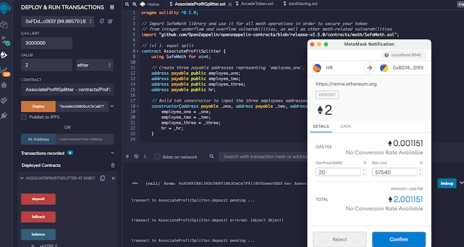

# HW-Solidity-ProfitSplitter_Contract

## Background

In this project we want to build smart contracts to automate some company finances tasks aiming to symplify an dincrease productivity. Using a smart contract on a blockchain will also increase transparency, and make accounting and auditing practically automatic!

To do so we will create smart contracts with Solidity.  we will create three "ProfitSplitter" contracts. These contracts will do several things:

* Pay your Associate-level employees quickly and easily (following an even distribution)

* Distribute profits to different tiers of employees.

* Distribute company shares for employees in a "deferred equity incentive plan" automatically.

## Instructions

* Use [Remix IDE](https://remix.ethereum.org/) to code your contracts in Solidity
  
* Run a local Network using Ganache
  
* Connect your MetaMask to your local Network and use it to "pay" the transactions

## First Contract : AssociateProfitSplitter

__AssociateProfitSplitter__  : 
This contract will accept Ether into the contract and divide the Ether evenly among the associate level employees. This will allow the Human Resources department to pay employees quickly and efficiently.

__Deploy the contract:__ 

__After deployment:__ 

__Example of payment:__
 

 __Employee new balance:__
  

__Transaction details:__

## Second Contract : TieredProfitSplitter

__TieredProfitSplitter__ : 
This contract will distribute different percentages of incoming Ether to employees at different tiers/levels. For example, the CEO gets paid 60%, CTO 25%, and Bob gets 15%.

__Deploy the contract:__

__Example deposit:__

__Example new Balance:__

__Example transaction details:__

## Third Contract : DeferredEquityPlan

__DeferredEquityPlan__ : In this contract we will be managing an employee's "deferred equity incentive plan" in which 1000 shares will be distributed over 4 years to the employee. We won't need to work with Ether in this contract, but we will be storing and setting amounts that represent the number of distributed shares the employee owns and enforcing the vetting periods automatically.

__Deploy the contract (local Network):__

__Test "Distribute"__ being rejected as expected:

__Test fastforward function:__

__Resultat after jumping 4 years forward:__

__Deploy the contract__ (Ropsten Test Network):

__Checking the contract on Ropsten Test Network__:

--------------
## Deploy the contracts on Ropsten Test Network

To lookup the transactions, and contracts you can go on Respten Test Net explorer: [Repsten_explorer](https://ropsten.etherscan.io/)

1. AssociateProfitSplitter Contract address on the Ropsten Test Network :  
0x8D74b484C7277504Ad47e99B27F91BAa72220193

2. TieredProfitSplitter Contract address on the Ropsten Test Network :  
0xa96357e8dc9D020092bf77AE623508771849D395

3. DeferredEquityPlan Contract address on the Ropsten Test Network :  
0xa7F3700E67DceF4A16A23e51Cb05A2D6E554f88B

